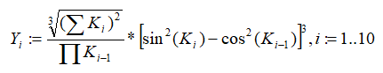
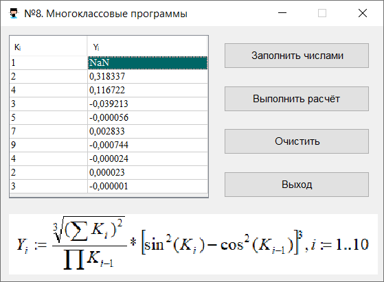

# SAA_ProgJava_tema8

| Фамилия, имя студента | Группа    | Дисциплина                       |Тема                        | Вариант|
| --------------------- |:---------:| ---------------------------------|:--------------------------:| ------:|
| Сембенова Асель       | ИС-302    | Программирование на Java         |8. Работа с классами в Java | 9      |

Задание:

Имеется таблица вещественных чисел в два столбца и 10 строк. В первом столбце имеются исходные данные - Ki. Необходимо выполнить расчет значений для второго столбце - Yi. Каждое значения Yi зависит от соответствующего значения Ki и предыдущих значений Ki по заданному в варианте алгоритму.
Необходимо написать программу, выполняющую данное задание. В программе необходимо сделать **класс**, обрабатывающий массив по алгоритму, указанному в варианте. Таблицу с данными реализовать через компонент **JTable**. 

Вариант 9:

Скриншот программы:

